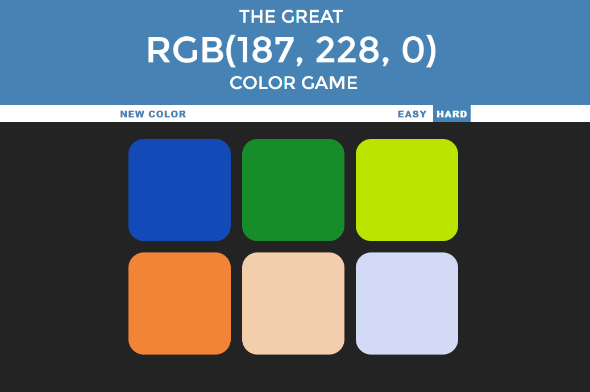

# Color-Guessing-Game
A RGB color guessing game - HTML, CSS, JavaScript
### See this project as a video : [YouTube](https://youtu.be/qmlPrm7bPz4)
### Play Online : [Color Guessing Game]( https://robin3317.github.io/Color-Guessing-Game/)

## Built with
- HTML5
- CSS3
- JavaScript

This is a small project but with lots of functionalities. A great project to refresh your JavaScript Knowledge.

## Made By
[Abdur Rahman Robin](https://github.com/robin3317)
- [Facebook](https://facebook.com/robin4java)
- [Twitter](https://twitter.com/robin4java)
- [Linkedin](https://www.linkedin.com/in/robin4java/)

### --------------Happy Coding------------------
